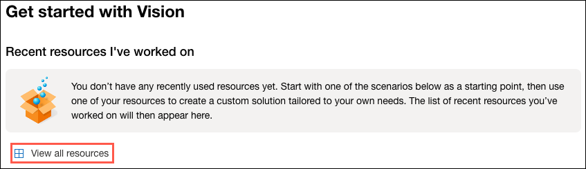
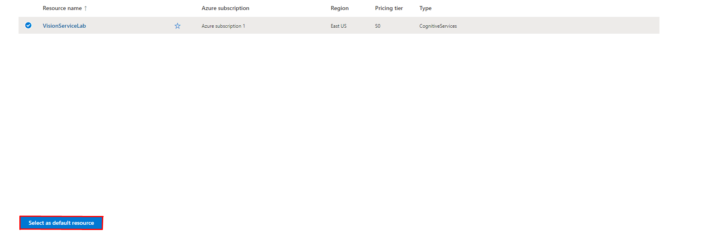
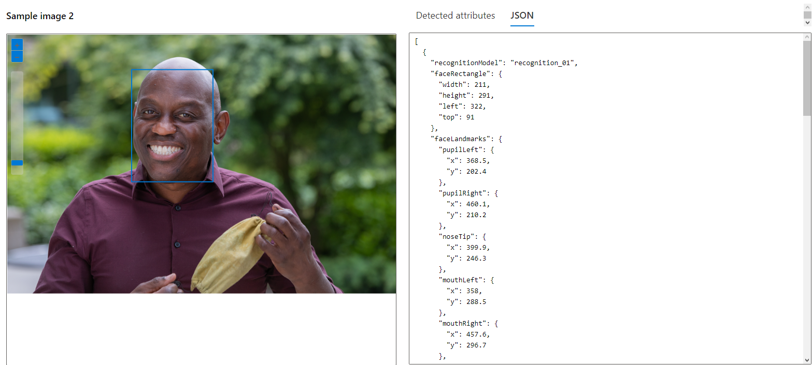
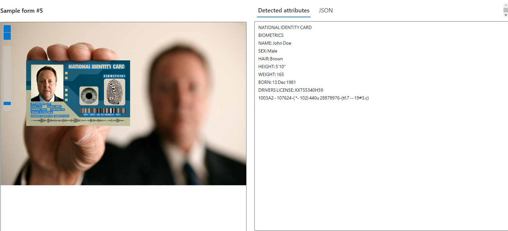
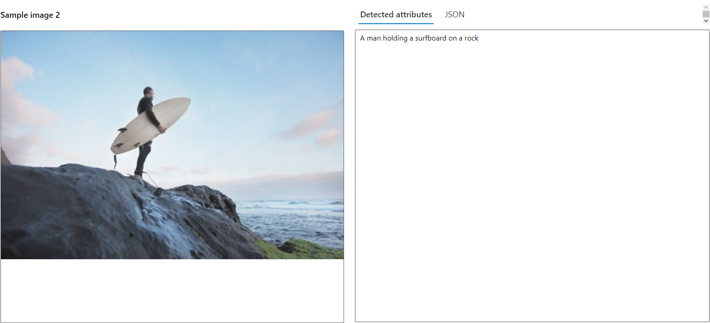

# Vision Service Lab

Inicialmente foi iniciado a criação de um recurso com a [Azure Cognitive Services](https://portal.azure.com/#create/Microsoft.CognitiveServicesAllInOne) utilizando o Resource Group __LABAI-900__ e foi dado o nome de __VisionServiceLab__ para o recurso.
Após Preencher os dados de criação, foi feita a examinação e criação do Recurso.

Levando em consideração que este recurso será utilizado apenas com o intuito de ser um laboratório, foram exploradas exclusivamente as noções básicas de configuração de criação.

# Desenvolvimento

### Teste Detecção de Faces

Após a criação do recurso, devemos acessar o [Vision Studio](https://portal.vision.cognitive.azure.com/gallery/featured), onde provavelmente será solicitado o login. Após feito o login e acessar o __Portal Vision Studio__, devemos acessar a opção "View all resources", cuja opção está demarcada na imagem abaixo.

Após acessarmos a aba de recursos, devemos selecionar o arquivo desejado e defini-lo como padrão. 

Após isso devemos retornar ao portal principal do Vision Studio e buscar a opção __Detect faces in a image__. Com isso, teremos em mão um menu de testes de detecção de faces, onde podemos selecionar uma imagem do banco de dados da própria azure ou importar uma imagem desejada para fazer esse reconhecimento, onde também podemos encontrar o codigo .json da imagem testada. Segue um exemplo abaixo:

### Teste Análise de Documentos

Dentro do [Portal Vision Studio](https://portal.vision.cognitive.azure.com/gallery/featured), selecionamos na aba de opções, a aba __Optical Character Recognition__. Dentro dessa aba selecionaremos a opção __Extract Text From Images__, que abrirá um menu de testes de análise de imagens com texto, do qual podemos extrair a escrita de documentos, fotos, etc. da mesma forma em que foi realizado o teste de detecção facial. Como no exemplo abaixo:

### Teste Análise de Imagem

Dentro do [Portal Vision Studio](https://portal.vision.cognitive.azure.com/gallery/featured), podemos encontrar a opção __Add Captions To Images__, em que podemos fazer testes em que o programa atribuirá legendas descrevendo as imagens selecionadas ou importadas. Como no exemplo abaixo:

## Possibilidades

Ao finalizar as etapas de testes, podemos encontrar opções que ensinam como utilizar esses programas para o dia a dia, linguagens que podem ser utilizadas, preço, etc.  
Com essas informações penso na otimização de atividades comerciais ou integração de serviços como esse a banco de dados, para facilitar o inserimento de dados em tabelas com base na extração de dados de imagens. Pouparia muito tempo.